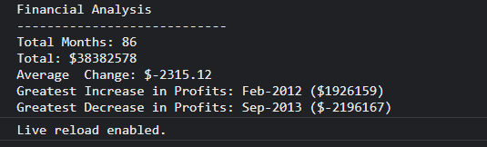

# Console-Finances

Console Finances Project

## Description 

This JavaScript challenge console-finances project, presents a real-world situation and showcases my skills and talents in the development of JavaScript code. The aim is to create code for analyzing the financial records of a company. using iteration with conditionals and for loops.

## Screenshot

## Tech Stack

- Semantic HTML5 markup
- CSS custom properties
- Flex-box
- Bootstrap 4.3

## Links

- Project URL:  https://github.com/smguerra/Bootstrap-Portfolio
- Live Site URL:  https://smguerra.github.io/Bootstrap-Portfolio/

## Author

Sandra Guerra

## Copyright

© 2022 edX Boot Camps LLC. Confidential and Proprietary. All Rights Reserved.